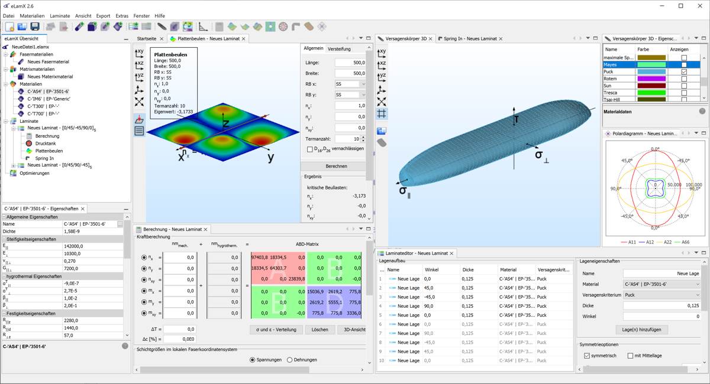

# eLamX2
eLamX² is an OpenSource, Java-written composite calculator, which is being developed at [Technische Universität Dresden](https://tu-dresden.de), [Institute of Aerospace Engineering](https://tu-dresden.de/ing/mw/ilr), [Chair of Aircraft Engineering](https://tu-dresden.de/ing/mw/ilr/lft). Calculations are based on the classical laminated plate theory. The program is based [Netbeans Platform](https://netbeans.apache.org/) and uses the [View3DSuite](https://github.com/AndiMb/View3DSuite).

