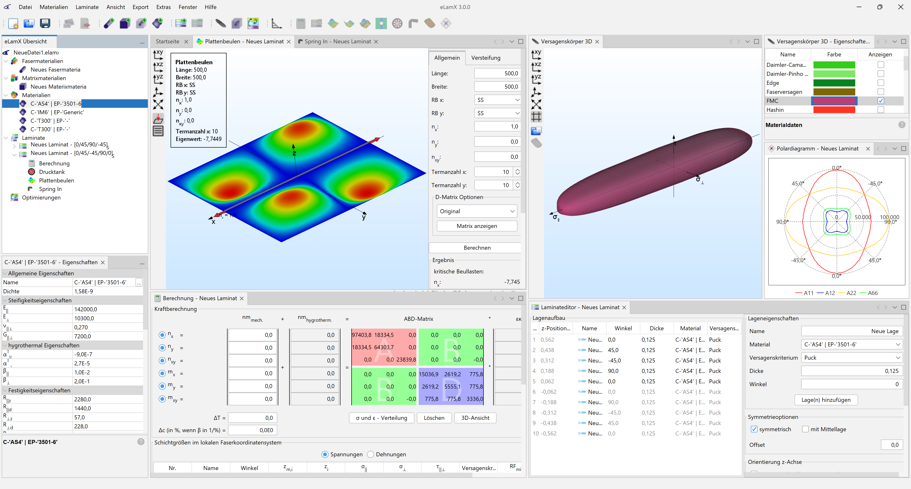

# eLamX
eLamX is an OpenSource, Java-written composite calculator, which is being developed at [Technische Universität Dresden](https://tu-dresden.de), [Institute of Aerospace Engineering](https://tu-dresden.de/ing/mw/ilr), [Chair of Aircraft Engineering](https://tu-dresden.de/ing/mw/ilr/lft). Calculations are based on the classical laminated plate theory. The program is based on the [Netbeans Platform](https://netbeans.apache.org/) and uses the [View3DSuite](https://github.com/AndiMb/View3DSuite).

## Downloading eLamX

You can download the latest release [here](https://github.com/AndiMb/eLamX2/releases).

## Coding eLamX

1. get and openJDK build, e.g. from https://adoptium.net/de/temurin/releases/
2. Unpack/install JDK
3. get Apache Netbeans from https://netbeans.apache.org/download
4. unpack/install Apache Netbeans
5. Open Apache Netbeans
6. clone eLamX2 https://github.com/AndiMb/eLamX2
7. Init GIT submodule View3DSuite by running "git submodule update --init --recursive" in the eLamX² clone directory

## Documentation

A documentation of the theory and usage of eLamX² can be found in the [wiki](https://github.com/AndiMb/eLamX2/wiki).
